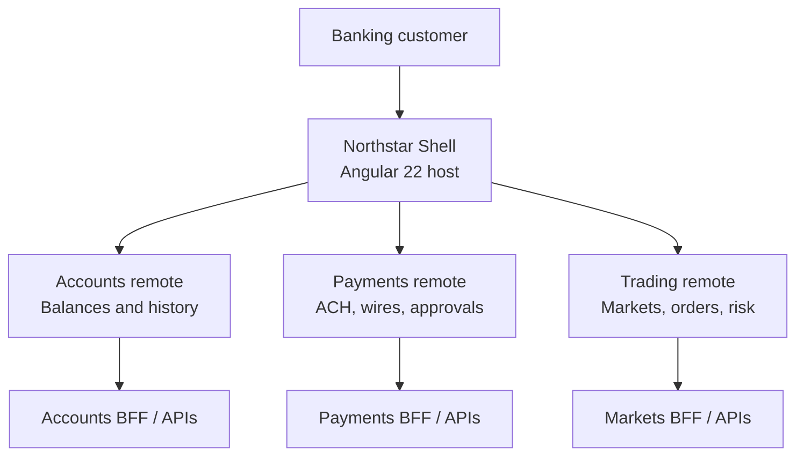
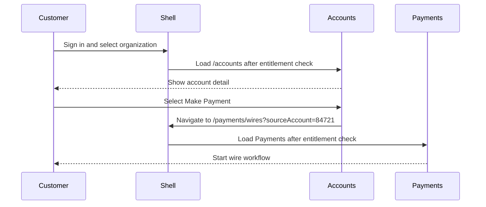

# Northstar Banking Platform

> An Angular 22 micro-frontend reference architecture for a commercial banking and fixed-income trading experience.

Northstar is a teaching application built to answer two questions at the same time:

1. How do we build modern Angular applications in Angular 22?
2. How do we let several independent teams ship business capabilities without making the customer experience feel fragmented? We use **micro-frontends**!

The platform is deliberately small enough to understand, but shaped like an enterprise system. It uses a Shell plus three independently deployable Angular remotes: **Accounts**, **Payments**, and **Trading**.

---

## The Product in One Paragraph

A commercial banking customer signs in once, selects their organization, and moves through Accounts, Payments, and Trading as if they are using one application. The Shell owns the secure and consistent platform experience. Each domain team owns its business capability, internal routes, APIs, tests, pipeline, and release schedule. Native Federation loads the remotes at runtime, so a Payments hotfix can be deployed without rebuilding Accounts, Trading, or the Shell.

The reason for micro-frontends is not that “the application got big.” It is that these domains have different business ownership, expertise, risk, and release needs.

---

## Platform Mission

> Build a modern enterprise banking platform demonstrating how Angular 22 and micro-frontend architecture can support independently owned business capabilities while preserving a unified, secure, accessible, observable, and high-performance customer experience.

| Application | Mission | Business ownership |
|---|---|---|
| [Shell](northstar-bank-shell-build-prompt.md) | Make independent applications feel like one trusted platform. | Platform / Enterprise UI team |
| [Accounts]() | Help customers understand their money. | Deposits / Account-servicing team |
| [Payments]() | Help authorized customers move money safely. | Payments / Treasury team |
| [Trading]() | Help institutional users react to live markets. | Markets / Fixed-income team |

---

## Architecture at a Glance



The browser loads one Shell application. The Shell initializes federation and then loads a remote only when its capability is needed. Each remote is an Angular application in its own repository. It is not a giant component imported from a sibling folder.

---

## Repository Map

```text
northstar-platform/                Architecture and shared documentation
bank-shell/                        Native Federation host
accounts-mfe/                      Accounts remote
payments-mfe/                      Payments remote
trading-mfe/                       Trading remote
northstar-platform-contract/       Versioned runtime interfaces
northstar-design-system/           Versioned shared components and tokens
```

The platform contract and design system are shared libraries. They are not micro-frontends because they are not independently mounted business applications.

---

## Who Owns What

### Shell owns the platform

- authentication/session integration;
- selected customer and organization context;
- entitlement checks and navigation visibility;
- global header, navigation, notifications, theme, and accessibility baseline;
- runtime federation startup and remote discovery;
- feature-flag and telemetry contracts;
- correlation IDs and global error handling;
- remote-unavailable fallback experience.

The Shell does not own account balances, payment workflows, or trading logic.

### Accounts owns account servicing

- account summaries and account detail;
- balances and available funds;
- transaction history and filters;
- statement discovery;
- handoff to Payments through a stable route.

Accounts does not create a wire, manage a recipient, or own an approval workflow.

### Payments owns money movement

- ACH and wire initiation;
- recipients;
- payment limits, cutoffs, validation, and fraud rules;
- dual approval;
- payment status and history.

Payments does not own the global session or reimplement account history.

### Trading owns market activity

- bond discovery, watchlists, pricing, bid/ask, yield, and spreads;
- positions and exposure;
- order tickets, blotter, and simulated execution;
- market-data stream handling and risk calculations.

Trading does not own a customer’s deposit-account balance or payment workflow.

---

## Micro-Frontend Contracts

The Shell owns the public mount point. Each remote owns routes beneath that point.

| Remote | Shell mount path | Logical name | Native Federation exposure | Expected export | Required entitlement | Local port |
|---|---|---|---|---|---|---|
| Accounts | `/accounts/*` | `accounts` | `./Routes` | `ACCOUNTS_ROUTES` | `accounts.read` | 4201 |
| Payments | `/payments/*` | `payments` | `./Routes` | `PAYMENTS_ROUTES` | `payments.create` | 4202 |
| Trading | `/trading/*` | `trading` | `./Routes` | `TRADING_ROUTES` | `trading.read` | 4203 |

For example, the Shell will eventually load Accounts conceptually like this:

```ts
import { loadRemoteModule } from '@angular-architects/native-federation';

{
  path: 'accounts',
  canMatch: [entitlementGuard('accounts.read')],
  loadChildren: () =>
    loadRemoteModule('accounts', './Routes').then(
      (remote) => remote.ACCOUNTS_ROUTES,
    ),
}
```

The Shell does not import the Accounts router, components, services, stores, or private model types. The public route and exposed module form the integration contract.

### Runtime manifest

The Shell uses a runtime manifest, allowing deployment locations to change without recompiling the host:

```json
{
  "accounts": "http://localhost:4201/remoteEntry.json",
  "payments": "http://localhost:4202/remoteEntry.json",
  "trading": "http://localhost:4203/remoteEntry.json"
}
```

The initial Shell manifest is intentionally `{}`. The platform must run before remotes exist and continue to provide useful navigation and failure handling when a remote is unavailable.

---

## A Customer Journey Across Boundaries



The important point is that Accounts passes an **intent** through navigation. It does not call a Payments service or manipulate Payments state. Payments independently validates the parameter, entitlement, and account eligibility.

---

## The Shared Runtime Contract

Remotes consume a small versioned library, not the Shell’s source code. A production form might be published as:

```text
@northstar/platform-contract
```

It should include only narrowly defined interfaces and injection tokens:

- readonly session and user context;
- selected organization/customer context;
- entitlement checks;
- platform navigation;
- telemetry and correlation IDs;
- feature-flag evaluation;
- notifications;
- carefully versioned cross-domain events.

Do not expose a general Shell store or service locator. If a remote can freely reach into host state, it is not independently deployable in any meaningful sense.

### Navigation before events

Use URLs whenever a cross-domain handoff can be expressed as navigation.

```text
/payments/wires?sourceAccount=84721
```

URLs are observable, bookmarkable, testable, and independent of framework internals. Typed events belong only where navigation cannot describe the handoff. Every event needs an owner, version, compatibility rule, and payload that excludes unnecessary sensitive data.

---

# Angular 16, Angular 18, and Angular 22: Architectural Review

If you stopped around Angular 16, Angular 22 is recognizable, but it wants to be structured differently. The largest shift is not a new decorator or a prettier template. Modern Angular is increasingly **standalone, signal-driven, zoneless, lazy by default, and based on direct dependency declaration**.

## The executive summary

| Earlier Angular habit | Angular 22 direction | Northstar decision |
|---|---|---|
| `AppModule` organizes the application | Standalone components and `bootstrapApplication()` compose it | No `AppModule` in new platform projects |
| Zone.js notices asynchronous work and starts broad synchronization | Signals and Angular notifications identify affected views | Zoneless application and explicit state notifications |
| `BehaviorSubject` is the default local store | Signals model synchronous current state | Private writable Signals, public readonly Signals |
| RxJS is used for all data and state | RxJS remains valuable for streams; Signals/resources simplify UI state | RxJS for market streams and complex orchestration, Signals for UI state |
| `*ngIf`, `*ngFor`, `ngSwitch` | Built-in `@if`, `@for`, `@switch` control flow | Modern control flow in every new template |
| Manual bundle splitting through module structure | Route-level lazy loading and `@defer` express loading intent | Lazy routes for capability pages; defer noncritical content |
| webpack Module Federation | esbuild-oriented Angular plus Native Federation | ESM/import-map-oriented Native Federation |
| Karma/Jasmine as the default test conversation | Angular’s current toolchain uses Vitest | Focused Vitest tests and contract tests |

Official Angular documentation describes Signals as granularly tracking where state is consumed, so the framework can optimize rendering updates. [Angular Signals](https://angular.dev/guide/signals)

## Angular 16: the inflection point

Angular 16 introduced Signals and made standalone architecture the practical direction for new applications. An Angular 16 developer likely still built most state with RxJS, still carried mental models built around Zone.js, and often still organized applications around NgModules. But the foundations of the current style arrived here.

The useful mindset change is:

```text
Angular 16 was not “just another release.”
It began changing Angular’s default unit of composition and reactivity.
```

### What to carry forward from Angular 16

- Dependency injection is still a central strength.
- RxJS is still excellent for events, cancellation, retries, WebSockets, and complex asynchronous composition.
- OnPush is still valuable, especially as a discipline for predictable rendering.
- Route-level lazy loading remains a key performance boundary.
- Strong component boundaries, services, API adapters, and test coverage still matter.

### What not to bring forward unchanged

- A `BehaviorSubject` for every piece of current UI state.
- `Subject`-driven component teardown boilerplate as the default pattern.
- App-wide `NgModule` hierarchy for all new applications.
- Assuming Zone.js will notice an arbitrary state mutation.
- Making every remote import the host’s service layer.

## Angular 18: transition to the current toolchain and rendering model

Angular 18 was a key transition release. Modern control flow and deferrable views were part of the normal Angular discussion, while the framework’s esbuild/Vite-based build direction and zoneless work became more visible. It is a useful stepping stone because it shows the new style without hiding the older mental model.

For this platform, Angular 18 matters because it helps explain why we now express boundaries in code:

- routes say what is lazy;
- `@defer` says what can wait;
- template control flow expresses UI branches directly;
- Signals say which state a template consumes;
- platform contracts say which runtime dependencies a remote may use.

## Angular 22: the default architecture for this project

Angular 22 is the target version for Northstar. It supports a development style that is much closer to the architecture we want to teach.

### 1. Standalone components are normal composition

Instead of beginning with `AppModule`, a new Angular 22 application commonly starts here:

```ts
bootstrapApplication(AppComponent, appConfig);
```

A component declares the directives, pipes, and child components it uses. This makes dependencies direct and improves local reasoning, especially in a remote where each compiled artifact needs a clear public surface.

```ts
@Component({
  standalone: true,
  imports: [CurrencyPipe, RouterLink, AccountCardComponent],
  changeDetection: ChangeDetectionStrategy.OnPush,
  templateUrl: './account-overview.page.html',
})
export class AccountOverviewPage {}
```

NgModules still exist and Angular continues to support them, but they are not the default architecture for new Northstar code.

### 2. Signals change local state ownership

A Signal is a value wrapper that notifies its consumers when it changes. Signal reads in templates establish dependencies, which lets Angular update the views that care about that state. [Angular Signals](https://angular.dev/guide/signals)

```ts
@Injectable({ providedIn: 'root' })
export class ShellStore {
  private readonly _navigationOpen = signal(false);

  // Consumers may observe Shell navigation state, but cannot mutate it.
  readonly navigationOpen = this._navigationOpen.asReadonly();

  readonly unreadNotifications = computed(
    () => this.notifications().filter((item) => !item.read).length,
  );

  toggleNavigation(): void {
    this._navigationOpen.update((isOpen) => !isOpen);
  }
}
```

This is not merely a shorter `BehaviorSubject`. It makes ownership visible:

- the store keeps the writable Signal private;
- consumers receive a readonly Signal;
- derived state is expressed with `computed()`;
- templates read state by calling it: `navigationOpen()`.

Use `effect()` sparingly for actual side effects such as synchronizing a non-Angular browser API or writing an explicitly allowed telemetry event. Do not use `effect()` to copy state from one Signal to another when `computed()` or a normal command method would express the intent better.

### 3. Zoneless Angular is the default

Angular v21 and later are zoneless by default. Zone.js no longer has to patch browser APIs and trigger broad view synchronization after asynchronous work. Angular instead relies on notifications from Signals, template listeners, `ComponentRef.setInput`, `markForCheck`, and similar supported mechanisms. [Angular’s zoneless guide](https://angular.dev/guide/zoneless)

Why this matters:

- lower startup and runtime overhead;
- clearer stack traces;
- fewer browser API patches;
- fewer “why did change detection run?” mysteries;
- better compatibility with modern browser APIs.

It also changes engineering discipline. An old arbitrary object mutation may no longer automatically update the view. Keep template state in Signals, use Angular event handlers, use `AsyncPipe` or Signals when consuming Observables, and make change-notification paths intentional.

`OnPush` is not strictly required for zoneless applications, but Angular recommends it as a useful step toward zoneless compatibility for application components. [Zoneless compatibility](https://angular.dev/guide/zoneless)

### 4. Modern template control flow replaces star syntax

```html
@if (portfolio.value(); as accounts) {
  @for (account of accounts; track account.id) {
    <app-account-card [account]="account" />
  }
} @else {
  <app-resource-status [state]="portfolio.status()" />
}
```

This replaces the familiar `*ngIf` and `*ngFor` style. The important architectural gain is clarity: the template expresses branches, loops, and empty states directly, and `track` makes identity explicit. See [Angular control flow](https://angular.dev/guide/templates/control-flow).

### 5. `httpResource()` brings request state into the Signal model

For request/response data such as accounts, recipients, statement metadata, and order details, `httpResource()` offers a Signal-oriented representation of loading, value, error, and request state. It is a good fit when a request is driven by Signal parameters.

```ts
readonly accountId = input.required<string>();

readonly account = httpResource<AccountSummary>(() =>
  `/api/accounts/${encodeURIComponent(this.accountId())}`,
);
```

For Northstar:

- Accounts uses it for portfolio, account detail, transactions, and statements.
- Payments uses it for recipients, payment history, limits, and reference data.
- Trading does **not** use it for a live market-data stream. Trading uses RxJS/WebSockets for the stream, then writes the latest view state into Signals.

`httpResource()` is intentionally useful for read-oriented data, not an automatic replacement for every write workflow. Review its experimental/production status and constraints for the chosen Angular patch release before putting it into a regulated production system. [Angular httpResource guide](https://angular.dev/guide/http/http-resource)

### 6. RxJS remains important

Signals do not replace RxJS. The useful split is:

| Problem | Default fit |
|---|---|
| Current UI state, selection, view mode, derived totals | Signals and `computed()` |
| HTTP request state driven by a parameter | `httpResource()` where appropriate |
| WebSocket market feed | RxJS stream feeding Signal state |
| Debounce, cancellation, retries, merge, switch, fan-out | RxJS operators |
| Multi-step payment orchestration | RxJS or an explicit async workflow service |
| One-time imperative side effect | Command method or carefully scoped `effect()` |

The architecture question is no longer “Signals or RxJS?” It is “What kind of time and state behavior are we modeling?”

### 7. Lazy loading and deferrable work are first-class

Use lazy routes to load feature capabilities only when the user needs them. Use `@defer` for content inside an already-loaded page that is not immediately necessary, such as a statement preview, education panel, or a heavy visualization.

```html
@defer (on viewport) {
  <app-portfolio-allocation-chart />
} @placeholder {
  <app-chart-placeholder />
}
```

Do not use `@defer` as a substitute for real ownership boundaries. A trading chart is still a Trading component or remote, not a random lazy component inside the Shell.

### 8. Build tooling and federation changed

The Angular CLI’s newer build direction is esbuild-based. Traditional webpack Module Federation remains a known pattern, but Northstar uses `@angular-architects/native-federation` to work with browser-native ESM and import maps while preserving the runtime-host/remote concept.

```text
Shell starts
  -> reads federation manifest
  -> resolves remote entry
  -> shares Angular runtime dependencies as strict singletons
  -> loads remote route configuration
  -> mounts remote below its stable public route
```

This is the runtime-composition layer. It does not eliminate the need for versioning, contracts, observability, and failure handling. Those are the cost of independent deployment.

---

## Modern Angular Decisions in Northstar

| Concern | Northstar standard | Why |
|---|---|---|
| Application composition | Standalone components | Direct dependencies and clear remote boundaries |
| Change detection | Zoneless + explicit `OnPush` | Intentional update paths and predictable rendering |
| Local state | Private writable Signals, readonly public Signals | Ownership and safe consumption |
| Derived state | `computed()` | Declarative, memoized derivation |
| Side effects | Small, documented `effect()` usage | Avoid accidental reactive loops |
| Request state | `httpResource()` where suitable | Signal-native load/value/error state |
| Event streams | RxJS, converted to Signals at UI edge | RxJS remains the right tool for streaming behavior |
| Templates | `@if`, `@for`, `@switch`, `@defer` | Clearer rendering and loading intent |
| Tests | Vitest plus component and contract tests | Faster feedback and integration confidence |
| Federation | Native Federation dynamic host/remote | Independent runtime deployment |
| Shared code | Versioned libraries only | Prevent Shell-to-remote implementation coupling |

---

## Security and Trust Boundaries

This is a banking teaching platform, so its architecture must model security correctly even when data is simulated.

### Authentication is not authorization

The Shell supplies a session context. A remote may ask whether a user has an entitlement such as `payments.create`, but every API must independently validate the user’s token and permissions. A hidden button or a route guard does not secure a wire-transfer API.

### Required entitlements

```ts
type BankingEntitlement =
  | 'accounts.read'
  | 'payments.create'
  | 'payments.approve'
  | 'trading.read'
  | 'trading.execute';
```

Route guards improve navigation and avoid loading code the user cannot use. The BFF/domain API remains the authoritative enforcement point.

### Remote trust

- Load remote locations only from controlled runtime configuration.
- Do not accept remote URLs from query parameters, local storage, or user input.
- Maintain a CSP that explicitly permits trusted remote origins.
- Share Angular dependencies as strict singletons to avoid multiple incompatible framework runtimes.
- Treat the remote manifest as deployment metadata that requires its own integrity and change-control process.

### Privacy

- Never put tokens, account numbers, balances, payment details, order details, or personal data into browser telemetry.
- Do not persist banking data in browser storage.
- Treat route/query parameters and remote API data as untrusted.
- Do not use client-side filtering as security.

---

## Observability and Failure Handling

The platform must remain understandable when distributed pieces fail.

Every application emits the same logical telemetry envelope:

```ts
interface PlatformTelemetryEvent {
  eventName: string;
  timestamp: string;
  correlationId: string;
  application: 'shell' | 'accounts' | 'payments' | 'trading';
  version: string;
  route?: string;
  durationMs?: number;
  outcome?: 'success' | 'failure';
  metadata?: Record<string, string | number | boolean>;
}
```

The Shell records remote load start, success, failure, and duration. Each remote records its own resource and workflow outcomes. Do not place sensitive banking data inside `metadata`.

### Failure isolation

If Accounts fails to load:

- the Shell remains usable;
- Payments and Trading remain independently reachable;
- the customer sees an accessible Accounts-unavailable page;
- the page offers finite retry and return-to-overview actions;
- a correlation ID helps support and logs connect the user experience to diagnostics.

That is the critical runtime promise: a remote failure should be a capability failure, not a platform outage.

---

## Accessibility Is a Platform Requirement

The Shell establishes the baseline. Every remote must uphold it.

- semantic landmarks and a single, deliberate main-content strategy;
- skip link and visible keyboard focus;
- native buttons and links;
- active state indicated by more than color;
- keyboard-operable account tables, filters, payment forms, and order tickets;
- no color-only debit/credit, pending/posted, risk, or validation indicators;
- form labels, error summaries, and helpful status messaging;
- reduced-motion and high-contrast support;
- WCAG 2.2 AA contrast and interaction target.

Micro-frontends increase the need for shared accessibility standards. A remote cannot be “independent” in a way that breaks keyboard flow or duplicates confusing page landmarks.

---

## Local Development

### Prerequisites

- Node.js 22.12+ or Node.js 24
- npm 11+
- Angular CLI is installed through each repository’s local dependencies

### Development ports

| Service | Port | Purpose |
|---|---:|---|
| Shell | 4200 | Host, platform chrome, runtime federation manifest |
| Accounts | 4201 | Accounts remote standalone/federated development |
| Payments | 4202 | Payments remote standalone/federated development |
| Trading | 4203 | Trading remote standalone/federated development |
| Accounts mock API | 3001 | Fictional account, transaction, and statement data |
| Payments mock API | 3002 | Fictional recipients, payments, and approvals |
| Trading mock API/feed | 3003 | Reference data and simulated market stream |

### Run the Shell alone

```bash
cd bank-shell
npm install
npm start
```

With an empty `public/federation.manifest.json`, the Shell runs with local placeholders for the future remotes.

### Connect remotes locally

Start each remote in its own terminal, then update the Shell manifest:

```json
{
  "accounts": "http://localhost:4201/remoteEntry.json",
  "payments": "http://localhost:4202/remoteEntry.json",
  "trading": "http://localhost:4203/remoteEntry.json"
}
```

Test each capability independently:

```text
http://localhost:4200/accounts
http://localhost:4200/payments
http://localhost:4200/trading
```

Then test deep links by refreshing an internal remote route, such as:

```text
http://localhost:4200/accounts/84721/transactions?direction=debit
```

Your development server and production host must both return the Shell entry point for client-side routes, or deep links will fail before Angular can resolve them.

---

## Testing Strategy

### Shell

- entitlement guards;
- remote registry and manifest behavior;
- unavailable-remote fallback;
- responsive navigation state;
- telemetry sanitization;
- platform-contract compatibility.

### Accounts

- API DTO adapters;
- summary calculations;
- transaction filters and URL serialization;
- loading, empty, not-found, and retry states;
- payment-handoff URL contract.

### Payments

- recipient and payment validation;
- amount and cutoff rules;
- duplicate-submission prevention;
- entitlement and approval transitions;
- confirmation and audit event creation.

### Trading

- market stream to Signal-state adaptation;
- stale/reconnection handling;
- order validation;
- position and exposure calculation;
- rendering performance with a large watchlist.

### Cross-application contract tests

Every remote must test its public federation export, required platform-contract version, route contract, and event/navigation payloads. These tests are how independent deployment becomes less risky than “it worked when we rebuilt the monolith together.”

---

## Deployment Principles

- Each remote has its own repository, CI/CD pipeline, test suite, artifact, and release cadence.
- The Shell resolves remote entry points at runtime from controlled configuration.
- A routine Accounts release does not rebuild Payments, Trading, or the Shell.
- Shared contract and design-system changes follow semantic versioning and compatibility policy.
- Production deployment validates manifest changes, remote availability, CSP, source maps, telemetry, and rollback behavior.
- Release independence never means compatibility independence. Contract changes still require ownership and testing.

---

## Architecture Tradeoffs

Micro-frontends are a trade, not a free upgrade.

| Gain | Cost |
|---|---|
| Independent domain ownership | More runtime integration design |
| Independent deployments | Version and compatibility discipline |
| Smaller team codebases | More repositories and pipelines |
| Failure isolation | More failure modes to test |
| Clear business boundaries | Shared design and UX governance required |
| Targeted lazy loading | Remote loading and observability complexity |

Northstar is a good micro-frontend candidate because Accounts, Payments, and Trading are meaningful business capabilities with different subject matter, teams, APIs, and change velocity. It would be a poor candidate if we split simple header, button, or table widgets into separately deployed applications.

---

## Learning Path

1. Start with the Shell. Trace bootstrap, routes, Signals, entitlement guard, remote registry, and failure page.
2. Build Accounts. Practice standalone components, Signals, `computed()`, `httpResource()`, modern control flow, adapters, and route contracts.
3. Build Payments. Add forms, validation, workflow state, entitlements, approval rules, error handling, and audit thinking.
4. Build Trading. Combine RxJS market streams with Signal-driven UI state, then focus on rendering and performance.
5. Replace development adapters with versioned platform contracts and production BFF/API integrations.

By the end, this is not just an Angular refresh project. It is evidence of how you would design, govern, and build a modern enterprise UI platform.

---

## Further Reading

- [Angular Signals](https://angular.dev/guide/signals)
- [Angular without ZoneJS](https://angular.dev/guide/zoneless)
- [Angular control flow](https://angular.dev/guide/templates/control-flow)
- [Reactive data fetching with `httpResource`](https://angular.dev/guide/http/http-resource)
- [Angular versioning and releases](https://angular.dev/reference/releases)
- [Native Federation for Angular](https://www.npmjs.com/package/@angular-architects/native-federation)

---

## Status

| Area | Current state |
|---|---|
| Shell architecture and initial implementation | In progress / foundation established |
| Accounts remote design | Build prompt complete |
| Payments remote design | Next build prompt |
| Trading remote design | Planned after Payments |
| Shared platform contract package | Designed; to be extracted into a versioned library |
| Shared design system package | Designed; to be extracted into a versioned library |
