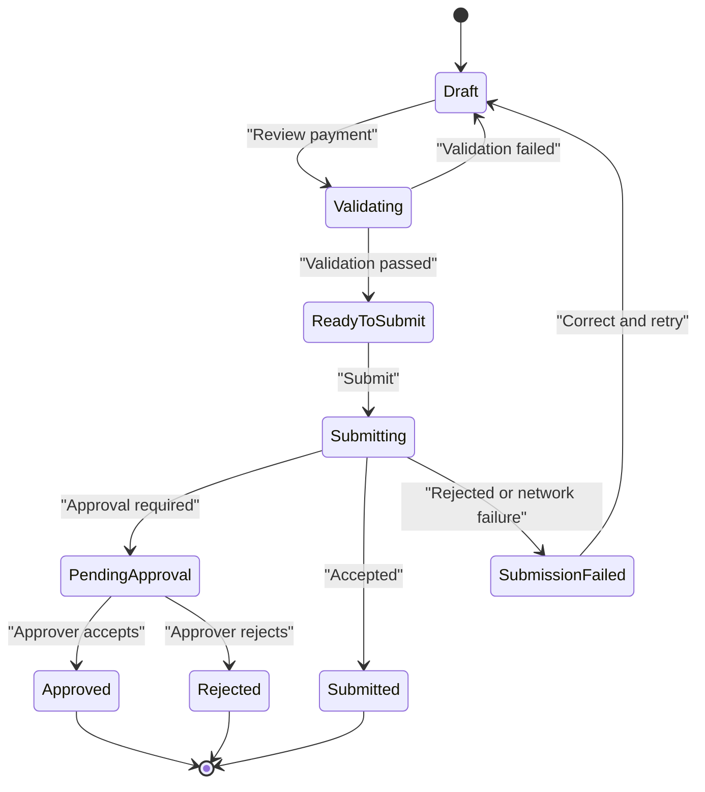

# Build Prompt: Northstar Payments

Use this as the instruction prompt for an AI coding agent to scaffold and build the **Northstar Payments** project.

---

## Context

You are building **Payments**, an independently deployable Angular remote in the Northstar commercial-banking platform.

Northstar consists of four separately owned applications:

1. **Shell** — the Angular 22 Native Federation host. It owns session/customer context, global navigation, feature flags, platform telemetry, the shared visual frame, and remote discovery.
2. **Accounts** — an independently deployable remote. It owns account summaries, balances, transaction history, and statements.
3. **Payments** — this project. It owns payment initiation, recipients, payment validation, approval workflow, confirmation, and payment history.
4. **Trading** — a future remote. It owns market data, watchlists, positions, orders, and risk.

Payments must run in two modes:

- **Standalone development mode** on port `4202`, with development-only providers for the shared platform contract.
- **Federated mode** mounted under the Shell’s stable `/payments/*` route at runtime through Native Federation.

The Shell and Accounts are separate repositories. Payments must never import their private components, stores, routes, models, or source files. It consumes only the public versioned platform contract such as `@northstar/platform-contract`.

This build is a **simulated learning application**, not a real payment system. It must model the architecture, controls, and user experience of a payment workflow without using real bank credentials, routing numbers, customers, funds, external payment rails, or production payment initiation.

The project has two teaching goals:

1. **Modern Angular (the “how”):** Angular 22, standalone components, zoneless rendering, explicit `OnPush`, Signals and `computed()` for state, modern template control flow, `httpResource()` for request-driven reference/history data, typed reactive forms where they fit, lazy routing, Vitest, and Native Federation as a remote.
2. **Enterprise payments architecture (the “why”):** a bounded context that owns a controlled workflow; separation of input validation from server authority; entitlements and approval; idempotency; auditability; API adaptation; cross-remote handoff; failure recovery; accessibility; telemetry; and independent deployment.

Comment generously. Comments must explain the architectural reason for a decision, not merely narrate the next line of code.

Target comment quality:

```ts
// The review snapshot is immutable once submission begins. That gives the user
// a clear confirmation of what they authorized and prevents a late form change
// from silently altering the payload while the submit request is in flight.
```

Assume the reader is an experienced Angular 2–16 developer and UI Architect who knows banking concepts and is learning modern Angular and micro-frontend platform design.

---

## Payments Mission

> Allow authorized commercial-banking customers to move money through a clear, controlled, auditable workflow.

Payments is where this platform moves from viewing data to performing a business action. The workflow must make a customer’s intent clear before submission and make the system’s outcome clear afterward.

The finished remote should demonstrate:

1. Choosing a payment rail and source account.
2. Selecting or adding a recipient.
3. Entering and validating payment instructions.
4. Reviewing an immutable summary of the intended payment.
5. Submitting exactly once.
6. Receiving a confirmation, rejection, or approval-required result.
7. Finding a payment later in history.

---

## Why Payments Is a Micro-Frontend

Payments is not a micro-frontend because it has many screens. It is a micro-frontend because it is a meaningful business capability with its own:

- product owner and policy owners;
- payments subject-matter experts;
- release cadence and urgent hotfix needs;
- API/BFF and integration dependencies;
- security, fraud, and audit requirements;
- test strategy;
- deployment and operational ownership.

Accounts answers “what money do I have?” Payments answers “may I move it, under what controls, and what happened?” Those are related but distinct domains. A validation change for wire transfers must be deployable without rebuilding Account history or Trading.

The cost is real: runtime loading, version compatibility, distributed telemetry, contract testing, and failure handling. Northstar accepts that cost only because the organizational and business independence is valuable.

Do not split Payments into `recipient-mfe`, `wire-form-mfe`, `approval-mfe`, or `payment-table-mfe`. Those are internal components and features of one payments bounded context, not independently deployed business applications.

---

## What Payments Owns

### Payment dashboard

- Payment activity summary.
- Pending approvals count for authorized approvers.
- Recent payment status.
- Entry points for Wire and ACH.
- Payment history and saved-recipient entry points.

### Payment initiation

- Payment rail selection: Wire and ACH.
- Source account selection.
- Recipient selection and recipient creation in the simulator.
- Amount, currency, execution date, and memo/reference entry.
- Client-side format and completeness validation.
- Payment review snapshot.
- Submission request and outcome display.

### Recipient management

- Recipient list and search.
- Recipient detail.
- New recipient form in the simulator.
- Recipient status such as active, pending verification, or disabled.
- Explicit explanation that beneficiary verification is simulated.

### Approval workflow

- Determine when simulator rules require a secondary approval.
- Pending-approval queue for users with `payments.approve`.
- Approve or reject a pending payment in the simulator.
- Clear status timeline and actor role labels.

### Payment history

- Filterable, paginated history.
- Status, rail, date range, and recipient filters.
- Payment detail and status timeline.
- Search by a safe reference identifier.

### Internal routing

Payments owns these child routes beneath the Shell mount point:

```text
/payments
/payments/wires
/payments/ach
/payments/recipients
/payments/recipients/new
/payments/history
/payments/history/:paymentId
/payments/approvals
```

The Shell owns `/payments/*`; it must not need to know the workflow pages beneath it.

---

## What Payments Explicitly Does Not Own

- Login, logout, token refresh, or global customer selection.
- Shell navigation, header, notifications framework, federation manifest, or global error handler.
- Account balances, transactions, statements, or account-detail rendering.
- Bond trading, positions, or market pricing.
- Real bank data, real recipients, actual payment-rail connectivity, or production ISO 20022 message transmission.
- Fraud-model implementation. The simulator may display a fictional validation outcome, but a real fraud engine remains a backend/security responsibility.

Payments may request source-account context from the platform or payment API, but must not import the Accounts remote or treat a query parameter as authoritative account data.

---

## Cross-Remote Handoff: Accounts to Payments

Accounts hands a customer into Payments using ordinary navigation:

```text
/payments/wires?sourceAccount=84721
```

This is intentionally not a direct component call, a shared mutable store, or an import from `accounts-mfe`.

### Payments responsibilities on arrival

Payments must:

1. Parse the optional `sourceAccount` query parameter.
2. Validate its format before using it.
3. Treat it as a suggestion, not authorization or proof of eligibility.
4. Ask the Payments API/reference-data service which source accounts the current user may use.
5. Preselect the account only if it is present and eligible.
6. Explain and recover gracefully if it is absent, invalid, or unavailable.
7. Record a sanitized `payments.handoff.received` telemetry event.

Payments must not receive or trust balance, available-funds, account-number, or entitlement data from Accounts through the URL. The browser URL contains the minimum opaque identifier needed to express intent.

### Handoff rules

- Accounts shows the action only when `payments.create` allows it.
- Payments independently enforces `payments.create` when the route loads and again at API boundaries.
- A standalone Payments harness may demonstrate the destination route without Accounts running.
- Payment workflow state never returns to Accounts as a shared in-memory object.
- After a successful simulated payment, a user may navigate to Payments history or back to Accounts; Accounts will retrieve its own fresh information from its API.

---

## Data Source: Local Payments API Simulator

Build Payments against a local HTTP simulator, not hardcoded in-memory arrays inside Angular components or services.

Run a lightweight mock BFF/API on port `3002`. It may use `json-server` plus custom middleware, Express, Fastify, or another minimal local mechanism. Include it and fictional seed data in the repository.

Suggested endpoints:

```text
GET  /api/payment-source-accounts?customerId=C98342
GET  /api/recipients?customerId=C98342
POST /api/recipients
GET  /api/payment-limits?customerId=C98342
POST /api/payments/validate
POST /api/payments
GET  /api/payments?customerId=C98342
GET  /api/payments/:paymentId
GET  /api/payments/approvals?customerId=C98342
POST /api/payments/:paymentId/approve
POST /api/payments/:paymentId/reject
```

### Simulated rules

The API simulator, not the browser, must make final rule decisions. Use clearly documented fictional rules:

| Rule | Simulator behavior |
|---|---|
| Payment creation | User needs `payments.create` |
| Approval | Amount over `$10,000` requires a second approver |
| Daily limit | User has a simulated `$50,000` daily limit |
| Wire cutoff | Same-day wire requests after 4:00 PM ET schedule for next business day |
| Recipient status | Disabled or pending-verification recipients cannot be used |
| Duplicate prevention | A repeated request with the same idempotency key returns the original result |
| Source account | Must be in the user’s eligible source-account list |

These are teaching rules, not real banking policy. Keep policy logic concentrated in the mock API so a later production BFF can replace it without rewriting the Angular workflow.

### Seed data

Use the fictional organization `Gokey Farms LLC`, customer ID `C98342`, and source accounts matching the Accounts remote’s opaque IDs. Seed:

- at least five recipients with active, pending, and disabled status;
- at least 15 payment-history records across ACH and Wire;
- pending, approved, rejected, submitted, scheduled, and failed status examples;
- at least two approval-required items;
- no real names, account numbers, routing numbers, payment instructions, or credentials.

---

## API Boundary and Domain Models

Treat all HTTP responses as external contracts. Keep API DTOs inside `data-access/api` and map them to Payments-owned models before feature code sees them.

Example external DTO:

```ts
interface PaymentApiDto {
  payment_id: string;
  customer_id: string;
  rail: 'ACH' | 'WIRE';
  source_account_id: string;
  recipient_id: string;
  amount: string;
  currency: string;
  requested_execution_date: string;
  status: string;
  approval_required: boolean;
  created_at: string;
}
```

Example Payments model:

```ts
type PaymentRail = 'ach' | 'wire';
type PaymentStatus =
  | 'draft'
  | 'pending-approval'
  | 'submitted'
  | 'scheduled'
  | 'completed'
  | 'rejected'
  | 'failed';

interface PaymentInstruction {
  readonly rail: PaymentRail;
  readonly sourceAccountId: string;
  readonly recipientId: string;
  readonly amount: Money;
  readonly executionDate: Date;
  readonly memo: string | null;
}

interface PaymentRecord extends PaymentInstruction {
  readonly id: string;
  readonly status: PaymentStatus;
  readonly approvalRequired: boolean;
  readonly createdAt: Date;
  readonly timeline: readonly PaymentStatusEvent[];
}
```

The adapter must:

- validate identifiers and required fields;
- map backend enum spelling into domain values;
- parse dates explicitly;
- preserve currency;
- avoid floating-point money operations where possible;
- reject malformed API data into a safe resource error;
- emit sanitized adapter-failure telemetry without raw payloads.

For the simulator, integer minor units or a decimal-string representation is preferred over JavaScript float arithmetic. Document the choice.

---

## Payment Workflow

Use an explicit finite state model. Do not let unrelated booleans such as `isReviewing`, `isSubmitting`, `isComplete`, and `hasError` drift into contradictory combinations.



### Workflow steps

1. **Payment type** — select Wire or ACH.
2. **Source account** — load eligible source accounts; optionally honor a valid Accounts handoff.
3. **Recipient** — select an active recipient or create one in the simulator.
4. **Details** — amount, execution date, and optional memo/reference.
5. **Review** — present an immutable summary before submission.
6. **Submit** — create one idempotency key and disable duplicate submit action while in flight.
7. **Outcome** — confirmation, approval required, policy rejection, or recoverable technical failure.

The review screen is not cosmetic. It is the clear boundary between drafting an instruction and authorizing a submission.

### Client validation versus authoritative validation

The client validates field presence, formatting, obvious ranges, and flow completeness for immediate feedback. The API validates entitlement, source-account access, recipient eligibility, limits, cutoff, duplicate request, business-day rules, and approval requirement.

The client must never present its local validation as a security guarantee or as final policy authority.

---

## Shared Platform Contract

Payments consumes only documented interfaces from `@northstar/platform-contract`:

- readonly session and user context;
- current customer/organization context;
- entitlement checks;
- platform navigation;
- correlation ID;
- structured telemetry;
- feature flags;
- notification request interface.

Create a development-only provider set for standalone mode. It supplies the same interfaces with fictional context, console telemetry, deterministic flags, and local navigation behavior.

Feature components must not branch on “am I inside the Shell?” The environment chooses adapters; Payments code depends on the interface.

### Entitlements

| Capability | Required entitlement |
|---|---|
| View Payments | `payments.create` or a documented read entitlement if added later |
| Create payment | `payments.create` |
| View approval queue | `payments.approve` |
| Approve/reject payment | `payments.approve` |
| View Accounts handoff entry | `payments.create` |

Feature flags may hide or stage functionality. They must never grant permission. APIs remain authoritative.

---

## Native Federation Remote Contract

Configure `@angular-architects/native-federation` for Angular 22 as a remote using the esbuild-based application builder.

```text
logical remote name: payments
development port:    4202
exposed module:      ./Routes
export name:         PAYMENTS_ROUTES
Shell mount path:    /payments
required entitlement: payments.create
```

Expose relative child routes:

```ts
export const PAYMENTS_ROUTES: Routes = [
  {
    path: '',
    loadComponent: () =>
      import('./features/payment-dashboard/payment-dashboard.page')
        .then((module) => module.PaymentDashboardPage),
  },
  {
    path: 'wires',
    loadComponent: () =>
      import('./features/payment-workflow/payment-workflow.page')
        .then((module) => module.PaymentWorkflowPage),
    data: { rail: 'wire' },
  },
];
```

Do not repeat `/payments` inside the remote route configuration. The Shell owns that prefix.

Share Angular framework packages and the platform-contract package as strict singletons. Do not share every dependency automatically; needless runtime sharing creates coupling between release trains.

---

## Angular 22 Requirements

- Angular 22.x and compatible TypeScript.
- Standalone components only, no NgModules.
- Zoneless change detection, no Zone.js dependency.
- Explicit `ChangeDetectionStrategy.OnPush` on routed and presentation components.
- Private writable Signals and public readonly Signals for Payments-owned UI/workflow state.
- `computed()` for derived step status, permissions, review readiness, filter summaries, and display values.
- Use `effect()` only for specific documented side effects such as sanitized telemetry or safe navigation synchronization.
- Modern template control flow: `@if`, `@for`, `@switch`; no `*ngIf` or `*ngFor`.
- `httpResource()` for read-oriented resources such as recipients, source-account eligibility, payment limits, approval queue, payment history, and detail.
- Use RxJS where debouncing, cancellation, retries, multi-step asynchronous orchestration, or interaction streams make it the clearer tool. Explain why.
- Use typed reactive forms for multi-field payment and recipient forms, or use Angular Signal Forms if the chosen Angular patch release and desired APIs are appropriate. Document the choice. Do not build an ad hoc form framework.
- Strict TypeScript and strict templates.
- No `any` outside a documented external boundary.

### Zoneless form note

Reactive Forms updates do not themselves guarantee view synchronization in a zoneless application. If a template consumes form state, connect it to an Angular notification mechanism or expose the relevant state through Signals. Do not rely on Zone.js behavior that will not exist. See [Angular’s zoneless guide](https://angular.dev/guide/zoneless).

---

## State Architecture

Use small stores/facades with clear workflow ownership:

- `PaymentDraftStore` — rail, source account, recipient, details, step, and immutable review snapshot.
- `RecipientStore` — recipient resource, query/filter state, and recipient creation interaction.
- `PaymentSubmissionStore` — validation result, idempotency key, submit state, and outcome.
- `PaymentHistoryStore` — filters, page, and history resource.
- `ApprovalQueueStore` — approval queue resource and approve/reject command state.

Do not create one giant global `PaymentsStore`. Do not place Payments data into Shell state. Do not use independent mutable component fields to represent one payment workflow.

The submission store owns the idempotency key. It is created once per intentional submission and reused only for a retry of that exact immutable review snapshot. Editing the draft must invalidate the review snapshot and require a new validation/review cycle.

---

## Security, Privacy, and Audit Requirements

This simulated project must teach correct security boundaries.

### Security rules

- Never use real payment credentials or external payment rails.
- Do not place bank tokens, routing numbers, full account numbers, payment instructions, or customer data in source control.
- Do not store payment drafts, recipient details, or payment history in browser storage.
- Treat query parameters, remote configuration, and API responses as untrusted.
- Validate/encode navigation parameters.
- Avoid `innerHTML` for API-provided descriptions or recipient names.
- Avoid verbose UI error messages that expose internal architecture, stack traces, or policy implementation details.
- Document Content Security Policy requirements for the Shell and remote origin.
- Load remote URLs only from controlled manifest configuration.

### Authorization rules

- Entitlement guards provide UX and code-loading control; they do not secure the API.
- The API simulator must model authorization decisions too.
- The server/API decides source-account eligibility, payment policy, approval requirement, and action authority.
- An approver must not approve their own payment in the simulator if that rule is enabled; document the simulated segregation-of-duties choice.

### Audit model

Every simulated payment should retain a status timeline with safe, fictional events such as:

```text
Draft created
Validated
Submitted
Pending approval
Approved by authorized role
Scheduled
```

Do not claim this browser-side history is legally sufficient audit logging. Production audit trails are append-only, server-controlled, durable, access controlled, and correlated to identity and system events.

---

## Telemetry and Resilience

Use the platform telemetry envelope:

```ts
interface PlatformTelemetryEvent {
  eventName: string;
  timestamp: string;
  correlationId: string;
  application: 'shell' | 'accounts' | 'payments' | 'trading';
  version: string;
  route?: string;
  durationMs?: number;
  outcome?: 'success' | 'failure';
  metadata?: Record<string, string | number | boolean>;
}
```

Examples of safe Payments events:

```text
payments.remote.mounted
payments.handoff.received
payments.source_accounts.load.succeeded
payments.recipient.create.succeeded
payments.validation.failed
payments.review.opened
payments.submission.started
payments.submission.succeeded
payments.submission.failed
payments.approval.approved
payments.history.load.failed
payments.adapter.mapping_failed
```

Never include payment amount, account identifiers, recipient names, memos, raw API bodies, user email, tokens, or full error responses in telemetry metadata.

### Resilience requirements

Every data-backed experience must distinguish:

- initial loading;
- refresh loading while current data stays visible;
- valid empty result;
- authorization failure;
- not found;
- validation/policy rejection;
- network/server failure;
- malformed response/adapter failure.

The submission experience needs special care:

- Do not automatically retry a payment submission after an ambiguous network failure.
- Preserve the review snapshot and clearly explain that the status is uncertain.
- Provide a safe next action: check payment history, use a deliberate status lookup, or contact support in a real product.
- Avoid showing “payment failed” when the server may have accepted it but the response was lost.
- Do not issue a new idempotency key for a status check of the original submission.

This is a key payments lesson: reliability is not only “catch errors and retry.” It is knowing when a retry could create a duplicate instruction.

---

## Accessibility Requirements

Meet a WCAG 2.2 AA target and ensure the workflow is usable without a mouse or color vision.

- Clear heading hierarchy for each workflow step.
- A visible stepper with text labels and current-step indication.
- Do not make the stepper the only way to advance; use clear Back/Continue controls.
- All form fields have visible labels, descriptions, and errors.
- Error summary is announced and links to invalid fields after deliberate submission/review action.
- Validation messages explain how to correct the value.
- Review screen is readable with a screen reader and visually emphasizes immutable values without relying on color.
- Confirmation/pending-approval/rejection states use text, icons, and color together.
- Buttons remain disabled only with explanatory text when possible.
- Recipient tables/lists are keyboard operable and responsive.
- Payment-history table has a caption, headers, accessible status labels, and a usable mobile representation.
- Do not trap focus inside a normal inline form step.
- Use `aria-live` sparingly for meaningful asynchronous outcomes, not every keystroke.
- Respect reduced-motion and high-contrast preferences.
- Avoid a second global `<main>` when federated into the Shell’s main content region; document the landmark strategy.

---

## Suggested User Experience

### Dashboard

Show:

- Wire and ACH primary actions;
- recent payment activity;
- pending approvals count when authorized;
- payment history entry point;
- recipient management entry point;
- a clearly visible simulated-data notice.

### Payment workflow

Show:

- rail-specific title and explanation;
- clear step state;
- eligible source account list;
- recipient selection and status;
- amount and date;
- live, nonauthoritative client validation;
- review snapshot;
- confirmation/approval-required/outcome view.

### Approval queue

Show:

- payment reference identifier;
- rail, source account masked label, recipient masked label, amount displayed locally, execution date, and submitter role in the UI;
- status timeline;
- Approve and Reject commands for eligible users;
- explicit simulated segregation-of-duties behavior;
- confirmation dialog for approval/rejection action.

### History

Show:

- filters for rail, status, date range, and reference;
- clear filter action;
- payment list with safe reference IDs;
- detail page with timeline and simulator outcome;
- empty and failure states.

Keep styling aligned with Northstar’s commercial-banking design system without depending on undocumented Shell CSS.

---

## Suggested Project Structure

```text
payments-mfe/
├── mock-api/
│   ├── fixtures/
│   │   ├── source-accounts.json
│   │   ├── recipients.json
│   │   ├── payments.json
│   │   ├── approvals.json
│   │   └── payment-limits.json
│   ├── policy-engine.mjs
│   └── server.mjs
├── src/
│   ├── app/
│   │   ├── data-access/
│   │   │   ├── adapters/
│   │   │   ├── api/
│   │   │   ├── repositories/
│   │   │   └── runtime-config/
│   │   ├── domain/
│   │   │   ├── payment.models.ts
│   │   │   ├── recipient.models.ts
│   │   │   ├── approval.models.ts
│   │   │   └── money.ts
│   │   ├── features/
│   │   │   ├── approval-queue/
│   │   │   ├── payment-dashboard/
│   │   │   ├── payment-history/
│   │   │   ├── payment-workflow/
│   │   │   └── recipients/
│   │   ├── platform/
│   │   │   ├── development-contract/
│   │   │   ├── handoff/
│   │   │   └── telemetry/
│   │   ├── shared-ui/
│   │   │   ├── payment-status/
│   │   │   ├── resource-status/
│   │   │   ├── money-input/
│   │   │   └── workflow-stepper/
│   │   ├── app.config.ts
│   │   ├── app.routes.ts
│   │   └── app.ts
│   ├── bootstrap.ts
│   ├── exposed.routes.ts
│   ├── main.ts
│   └── styles.scss
├── ARCHITECTURE.md
├── CONTRACT.md
├── DATA-CONTRACT.md
├── SECURITY.md
├── DEVELOPMENT.md
├── federation.config.mjs
├── package.json
└── README.md
```

Keep API DTOs, domain models, feature workflow state, and shared-platform integration visibly separate. Do not create a vague `shared` folder that becomes an ownership dumping ground.

---

## Testing Strategy

Use Angular 22’s test tooling and Vitest. Tests must verify payments behavior and contracts, not framework implementation trivia.

### Unit tests

- API DTO-to-domain adapter mapping and malformed-data handling.
- Date, cutoff, currency, and minor-unit helper behavior.
- Client-side field validation.
- Workflow state-machine transitions.
- Review snapshot immutability.
- Idempotency-key lifecycle.
- Handoff query parsing and preselection logic.
- Entitlement and feature-flag combinations.
- Payment-handoff URL compatibility from Accounts.
- Telemetry metadata allowlisting.

### Component tests

- Dashboard state and authorized actions.
- Recipient selection and disabled/pending recipient behavior.
- Form validation, labels, help text, and error summary.
- Review screen value accuracy.
- Submit button duplicate prevention.
- Pending approval, accepted, rejected, and uncertain technical outcome states.
- Approval queue actions.
- Payment history filters and empty/error states.
- Keyboard path through every workflow step.

### Mock API and integration tests

- Source-account eligibility response.
- Client request to policy-validation endpoint.
- Over-limit and cutoff decisions originate from the API simulator.
- A repeated submit with the same idempotency key returns the same result.
- An ambiguous submit-response failure does not make the client issue a new payment.
- Approval requires a qualifying user/role and updates history/timeline.
- 401/403, 404, 409, 422, 429, 500, latency, malformed response, and offline behavior map to controlled UI states.

### Federation and contract tests

- `PAYMENTS_ROUTES` is exposed from `./Routes`.
- Child routes remain relative to `/payments`.
- Standalone and federated provider configurations satisfy the same contract interfaces.
- Required platform-contract version is verified.
- Shell can load the remote without accessing private Payments files.
- Accounts-to-Payments handoff works with and without a valid source account.

### Accessibility tests

- Automated checks on dashboard, workflow, review, confirmation, history, recipient, and approval views.
- Keyboard-only flow from source account through final submission.
- Error summary and screen-reader announcement behavior.
- Status communication not dependent on color.

---

## Documentation Deliverables

### 1. `README.md`

Include:

- Payments mission and simulated-data scope;
- prerequisites;
- mock API startup;
- standalone remote startup on port `4202`;
- test and production-build commands;
- Shell manifest entry;
- recommended code-reading order;
- a clear explanation of why Payments is an independent remote;
- the Accounts handoff flow;
- next platform step: Trading.

### 2. `ARCHITECTURE.md`

Explain:

- Payments bounded context and why it is separate from Accounts;
- standalone and federated composition;
- workflow state machine;
- state ownership;
- API adapter boundary;
- client validation versus authoritative validation;
- idempotency and ambiguous-outcome handling;
- approval and segregation-of-duties simulation;
- independent deployment and its costs;
- resilience strategy;
- accessibility ownership.

### 3. `CONTRACT.md`

Define:

- remote name `payments`;
- development port `4202`;
- exposed module `./Routes`;
- export `PAYMENTS_ROUTES`;
- Shell mount path `/payments`;
- entitlements;
- platform contract inputs;
- telemetry events emitted;
- feature flags consumed;
- Accounts handoff query contract;
- prohibited imports;
- semantic-versioning and deprecation policy.

### 4. `DATA-CONTRACT.md`

Define:

- mock/production endpoint shapes;
- request/response DTOs;
- policy-validation behavior;
- idempotency-key rules;
- API error shape and mapping;
- pagination/filtering;
- currency/date rules;
- adapter behavior;
- migration from simulator to Payments BFF.

### 5. `SECURITY.md`

Explain:

- simulated-only scope;
- authentication versus authorization;
- client/server responsibility split;
- sensitive-data handling;
- idempotency and duplicate-submission protection;
- audit-trail limitations;
- CSP/remote origin considerations;
- OWASP-style client-side considerations such as XSS and unsafe error reporting.

### 6. `DEVELOPMENT.md`

Include:

- starting the simulator;
- standalone Payments development;
- connecting the remote to Shell;
- receiving Accounts handoff links;
- testing mock users with creator-only and approver entitlements;
- simulating cutoff, over-limit, recipient, policy, latency, duplicate, and ambiguous-submission cases;
- deep-link testing;
- bundle inspection;
- Native Federation troubleshooting;
- independent Git workflow.

---

## Definition of Done

- [ ] Angular 22 standalone remote created.
- [ ] Native Federation remote named `payments` configured.
- [ ] `./Routes` exposes `PAYMENTS_ROUTES`.
- [ ] Standalone development works on port `4202`.
- [ ] Federated mode works beneath Shell `/payments`.
- [ ] Zoneless change detection enabled.
- [ ] `OnPush` used consistently.
- [ ] Modern template control flow used throughout.
- [ ] Shared platform contract consumed without Shell or Accounts source imports.
- [ ] Development contract adapters provided.
- [ ] Local mock Payments API runs independently on port `3002`.
- [ ] All sample data is fictional.
- [ ] API DTOs remain in the data-access boundary.
- [ ] DTO-to-domain adapters implemented and tested.
- [ ] Payment dashboard implemented.
- [ ] Wire and ACH workflow implemented.
- [ ] Eligible source-account selection implemented.
- [ ] Accounts handoff parsed, validated, and safely preselected.
- [ ] Recipient list and simulated recipient creation implemented.
- [ ] Client validation and API policy validation clearly separated.
- [ ] Immutable review snapshot implemented.
- [ ] Idempotency key and duplicate-submission protections implemented.
- [ ] Approval-required path implemented.
- [ ] Approval queue and simulated approve/reject actions implemented.
- [ ] Payment confirmation, rejection, and ambiguous-outcome states implemented.
- [ ] Filterable payment history and detail timeline implemented.
- [ ] Loading, empty, unauthorized, not-found, malformed-data, policy, network, and server errors handled.
- [ ] Finite retry behavior implemented without unsafe automatic resubmission.
- [ ] Structured, sanitized telemetry implemented.
- [ ] Correlation ID passed through platform/API boundary where appropriate.
- [ ] Feature flags control availability but never grant authority.
- [ ] Responsive, keyboard-accessible workflow implemented.
- [ ] WCAG 2.2 AA expectations checked.
- [ ] Unit, component, integration, contract, federation, and accessibility tests pass.
- [ ] Remote bundle budget passes.
- [ ] Production build passes.
- [ ] Payments can deploy without rebuilding Shell or Accounts.
- [ ] `README.md`, `ARCHITECTURE.md`, `CONTRACT.md`, `DATA-CONTRACT.md`, `SECURITY.md`, and `DEVELOPMENT.md` completed.
- [ ] No Accounts balance/history implementation or Trading implementation exists in the repository.

---

## Output Format

- Provide the complete proposed file tree first.
- Then provide implementation file by file.
- Include meaningful comments at architectural decision points.
- Include the mock API simulator, fictional fixtures, policy engine, tests, and documentation as working project files.
- Do not replace critical workflow logic with unexplained TODOs.
- End with:
  1. exact dependency installation;
  2. mock-API and standalone start commands;
  3. test and production-build commands;
  4. Shell manifest entry required for Payments;
  5. Accounts-to-Payments handoff verification steps;
  6. idempotency and ambiguous-submission test steps;
  7. intentional architecture tradeoffs;
  8. human configuration needed before production.

Do not silently skip cross-remote handoff, entitlement enforcement, server-authoritative policy, idempotency, audit limitations, resilience, accessibility, testing, or documentation to save time. These are central to the Payments exercise.

Most importantly, do not solve payment workflow integration by importing Accounts or Shell internals. Payments is independent precisely because it receives a narrow intent, validates it through its own API contract, and can ship a hotfix without requiring the other applications to rebuild.
