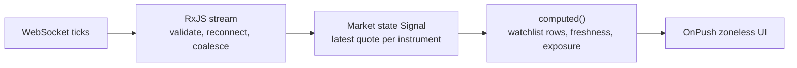

# Build Prompt: Northstar Trading

Use this as the instruction prompt for an AI coding agent to scaffold and build the **Northstar Trading** project.

---

## Context

You are building **Trading**, an independently deployable Angular remote in the Northstar commercial-banking platform.

Northstar consists of four separately owned applications:

1. **Shell** — the Angular 22 Native Federation host. It owns session/customer context, entitlements, global navigation, shared visual frame, runtime federation discovery, feature flags, telemetry contract, and remote-failure handling.
2. **Accounts** — an independent remote for balances, account detail, transactions, and statements.
3. **Payments** — an independent remote for ACH, wires, recipients, approvals, and payment history.
4. **Trading** — this project. It owns simulated fixed-income market data, bond discovery, watchlists, positions, order entry, blotter, and basic risk/exposure views.

Trading must run in two modes:

- **Standalone development mode** on port `4203`, using development providers for the shared platform contract and local simulated market services.
- **Federated mode** mounted at the Shell’s stable `/trading/*` path and loaded through Native Federation at runtime.

This is a teaching simulator. It must not connect to real exchanges, broker systems, market-data vendors, trading accounts, production order management systems, or execute financial transactions. All instruments, prices, positions, orders, and counterparty references must be fictional.

The two teaching goals are:

1. **Modern Angular:** standalone Angular 22, zoneless rendering, explicit `OnPush`, Signals for current UI state, `computed()` for derived pricing/risk state, RxJS for continuous event streams, modern control flow, lazy routing, `@defer` where appropriate, Vitest, and Native Federation as a remote.
2. **Enterprise trading UI architecture:** handling a high-frequency, data-intensive UI; creating clear boundaries between reference data, streaming data, order workflow, positions, and risk; applying backpressure/render coalescing; handling stale and disconnected data; isolating a remote that may change faster than other banking domains; and documenting the operational risks of real trading systems without pretending the simulator is one.

Comment generously at architectural decisions. Explain why data flows, update policies, and boundaries exist.

Target comment quality:

```ts
// The WebSocket feed may publish several ticks before the browser can paint.
// We coalesce updates to one animation frame so the UI displays the latest
// useful market state instead of spending rendering time on prices the user
// can never see. The feed remains in RxJS; the rendered snapshot is a Signal.
```

Assume the reader is an experienced Angular 2–16 developer and UI Architect who wants to understand Angular 22 and low-latency, market-data UI architecture.

---

## Trading Mission

> Build a simulated institutional fixed-income workspace that makes changing market information understandable and actionable without sacrificing performance, clarity, control, or safety.

Unlike Accounts and many Payments pages, the Trading screen changes even when the user does nothing. That makes it the platform’s laboratory for modern Angular reactivity.

The finished remote should let a permitted user:

1. View a live simulated bond watchlist.
2. Search and inspect fictional fixed-income instruments.
3. See bid, ask, yield, price change, and quote freshness.
4. View fictional positions and basic portfolio exposure.
5. Draft and submit a simulated buy or sell order.
6. See the order in an order blotter and simulate execution.
7. Recognize immediately when market data is stale, paused, or disconnected.

---

## Why Trading Is a Micro-Frontend

Trading earns an independent remote because it has a genuinely different business and technical profile from Accounts and Payments:

- market-data and trading specialists own its behavior;
- it has continuous data streams, quote freshness, high rendering pressure, and different performance budgets;
- its APIs, security controls, release cadence, and incident response differ from deposit-account servicing and payment workflows;
- pricing, order, and risk UI may change together rapidly without needing to redeploy the rest of the bank portal;
- trading users often need a specialized workspace while ordinary banking users do not need to download that capability.

The independent release value is concrete. A Trading team can improve quote coalescing, a bond-search view, or a blotter hotfix without rebuilding Accounts, Payments, or the Shell.

The cost is also concrete: runtime dependency compatibility, remote loading, telemetry correlation, testing, error isolation, and design-system governance. We accept that cost because Trading is a meaningful bounded context, not because it has a few visually complex widgets.

Do not split the trading workspace into separately deployed `watchlist-mfe`, `order-ticket-mfe`, or `chart-mfe`. These are coherent parts of the Trading domain and should be internal components/features of this one remote.

---

## What Trading Owns

### Market watch

- Simulated bond watchlist.
- Live bid/ask, price, yield, spread, and change display.
- Quote timestamp and freshness state.
- Watchlist sorting and filtering.
- Visible connection/reconnection state.

### Bond discovery

- Search by CUSIP-like fictional identifier, issuer, sector, maturity range, coupon, yield, or rating.
- Bond detail view.
- Reference data and latest quote presentation.
- Add/remove bond from local watchlist.

### Positions and exposure

- Fictional holdings by instrument.
- Quantity, market value, unrealized change, and percentage of portfolio.
- Simple exposure summaries by sector and maturity bucket.
- A clear statement that risk calculations are simplified for the simulator.

### Order entry and blotter

- Buy/sell order ticket.
- Instrument, side, quantity/par value, limit price, and order type.
- Client-side completeness/range validation.
- API-authoritative simulated validation and order acceptance.
- Immutable review snapshot before submit.
- Idempotency and duplicate-submit prevention.
- Order blotter with status updates and simulated execution.

### Internal routing

Trading owns routes beneath the Shell mount point:

```text
/trading
/trading/watchlist
/trading/search
/trading/bonds/:instrumentId
/trading/orders/new?instrument=...
/trading/orders
/trading/orders/:orderId
/trading/positions
/trading/risk
```

The Shell knows only that `/trading/*` belongs to this remote.

---

## What Trading Explicitly Does Not Own

- Login, logout, token lifecycle, global organization selection, or Shell navigation.
- Deposit-account balances, statements, transaction history, ACH, wires, recipients, or payment approvals.
- Production market-data subscriptions, exchange connectivity, broker-dealer integration, real CUSIPs, actual prices, actual order-routing, or suitability/compliance determinations.
- Authoritative risk, P&L, valuation, market-risk, credit-risk, or regulatory reporting calculations.
- Shell’s remote manifest, platform telemetry transport, global error handler, or design-system implementation.

Trading may show an account-like investment portfolio in the simulator, but it must not import Accounts data or models. Its positions API is its own domain boundary.

---

## Simulated Fixed-Income Data and Market Services

Build against local services, not browser-bundled arrays.

### Service endpoints

Run a local simulator on port `3003` that provides:

```text
GET  /api/instruments
GET  /api/instruments/:instrumentId
GET  /api/watchlists/default
PUT  /api/watchlists/default
GET  /api/positions?customerId=C98342
GET  /api/orders?customerId=C98342
GET  /api/orders/:orderId
POST /api/orders/validate
POST /api/orders
GET  /api/risk/exposure?customerId=C98342
WS   /market-data
```

Use a small local WebSocket server for the simulated market feed. A polling timer is not a substitute for this part of the learning exercise; the Trading remote needs a real event-stream boundary.

### Fictional instruments

Seed at least 40 fictional instruments covering:

- U.S. Treasury-like securities;
- investment-grade corporate bonds;
- high-yield corporate bonds;
- municipal bonds, including a Georgia-themed fictional issuer;
- agency-like securities;
- varied coupon, maturity, sector, rating, and liquidity values.

Use non-real identifiers such as `NST-UST-2035-0425` or `NORTHSTAR-GA-MUNI-2034`. Do not use real CUSIPs or claim that values represent the market.

### Market tick shape

Define a transport shape separate from the Trading domain model:

```ts
interface MarketTickApiDto {
  instrument_id: string;
  bid_price: string;
  ask_price: string;
  yield_percent: string;
  spread_bps: number;
  as_of: string;
  sequence: number;
}
```

The simulator should emit modest, believable random price movements at a configurable rate. It must be deterministic when a seed is supplied so tests can assert outcomes.

Create modes for:

- normal activity;
- high activity;
- delayed/stale feed;
- disconnect;
- reconnection;
- malformed tick;
- out-of-order sequence;
- duplicate tick.

Do not produce a firehose simply to claim “low latency.” The point is to demonstrate correct UI behavior under a continuous stream and explain how the architecture would scale.

---

## Data Boundaries and Domain Models

Treat reference-data APIs, position APIs, order APIs, and WebSocket messages as external contracts. Keep their DTOs in `data-access/api` and adapt them into Trading-owned models before components consume them.

Example domain models:

```ts
type InstrumentId = string & { readonly __brand: 'InstrumentId' };
type OrderId = string & { readonly __brand: 'OrderId' };

interface BondInstrument {
  readonly id: InstrumentId;
  readonly displaySymbol: string;
  readonly issuer: string;
  readonly sector: 'treasury' | 'agency' | 'corporate' | 'municipal';
  readonly couponPercent: number;
  readonly maturityDate: Date;
  readonly rating: string;
}

interface MarketQuote {
  readonly instrumentId: InstrumentId;
  readonly bidPrice: DecimalValue;
  readonly askPrice: DecimalValue;
  readonly yieldPercent: DecimalValue;
  readonly spreadBasisPoints: number;
  readonly asOf: Date;
  readonly sequence: number;
}

type OrderSide = 'buy' | 'sell';
type OrderStatus =
  | 'draft'
  | 'submitted'
  | 'working'
  | 'partially-filled'
  | 'filled'
  | 'rejected'
  | 'cancelled';
```

The adapter must validate identifiers, parse numeric strings explicitly, normalize enums, reject stale/out-of-order ticks, and emit sanitized mapping failures. No template should know `bid_price`, backend error envelopes, WebSocket message framing, or API enum spelling.

### Numbers, prices, and money

Do not use JavaScript floating-point arithmetic as a teaching shortcut for price, yield, notional, or P&L. Use a small decimal-value abstraction, integer scaled values, or an explicit decimal library. Document the choice.

For the simulator, describe price conventions clearly. If price is displayed as a percent of par, calculations must say so. If the simulator uses simplified math, state that it is educational and not a valuation engine.

---

## RxJS for the Feed, Signals for the Screen

This is the central Angular lesson in Trading.



### Rules

- Keep the WebSocket and stream lifecycle in a `MarketFeedService` using RxJS.
- Use RxJS for connection state, reconnect policy, message parsing, backoff, cancellation, ordering, and coalescing.
- Convert the latest valid market snapshot into a private writable Signal.
- Expose a readonly market-state Signal to components/stores.
- Use `computed()` for visible rows, quote freshness, price change, and derived display state.
- Do not create a `BehaviorSubject` application store simply because there is a stream.
- Do not write every tick directly into dozens of component fields.
- Do not render every incoming tick if multiple ticks arrive before the browser can paint.

### Coalescing and rendering policy

The feed may publish several events in one render window. Batch latest updates using `animationFrameScheduler`, `auditTime`, or an equivalent documented strategy, then update the market Signal once per animation frame or deliberate short window.

The goal is not to lose the latest market state; it is to avoid spending CPU rendering intermediate values the user cannot see.

Document:

- update frequency expected by the simulator;
- quote freshness threshold, for example 5 seconds;
- stale threshold, for example 15 seconds;
- reconnect/backoff behavior;
- out-of-order and duplicate sequence behavior;
- why the screen can remain responsive while the feed is busy.

### Zoneless implications

Angular v21+ is zoneless by default. Signals read by templates notify Angular which components need an update. A WebSocket callback that mutates an arbitrary object does not become a reliable rendering strategy merely because it worked under Zone.js. Use the Signal update path intentionally. See [Angular’s zoneless guide](https://angular.dev/guide/zoneless).

---

## Order Workflow and Safety Model

All orders are simulated. Nevertheless, model the workflow responsibly.

### Order steps

1. Select an instrument from a watchlist, search result, or detail page.
2. Open a Buy or Sell ticket.
3. Enter par quantity, order type, and limit price where applicable.
4. Validate basic client-side completeness and format.
5. Request server/simulator validation.
6. Present an immutable order-review snapshot with quote timestamp and freshness.
7. Submit once with an idempotency key.
8. Show submitted, working, rejected, partially filled, filled, or uncertain technical outcome.

### Order validation rules

The simulator must decide final policy. Use fictional rules such as:

| Rule | Simulator behavior |
|---|---|
| Order entry | `trading.execute` required |
| View market data | `trading.read` required |
| Quantity | Positive, within simulated max notional |
| Sell order | Cannot exceed simulated eligible position |
| Limit order | Price must be inside configured protection band around latest quote |
| Quote freshness | User must refresh/review if quote is stale |
| Duplicate submit | Same idempotency key returns original order outcome |
| Trading session | Simulated session availability controls acceptance |

Client validation improves feedback. API/simulator validation is authoritative.

### Ambiguous submission

Never blindly retry a submit after a network error. Preserve the immutable review snapshot and idempotency key. Offer a safe status lookup against the order API and a clear explanation that the simulator cannot yet determine the outcome. This is the same important reliability lesson as Payments: a retry can create a duplicate instruction.

### Review snapshot

The review screen should include:

- instrument and side;
- par quantity/notional convention;
- order type and limit price;
- current quote and quote timestamp;
- simplified estimated value;
- warnings for stale quote or simulated risk limit;
- explicit statement that the order is simulated.

Once review/submission begins, changes to the ticket invalidate the review snapshot and require a new validation cycle.

---

## Shared Platform Contract

Trading consumes only documented public interfaces from `@northstar/platform-contract`:

- readonly session/user context;
- selected customer/organization context;
- entitlement checks;
- platform navigation;
- correlation ID;
- structured telemetry;
- feature flags;
- platform notification request interface.

Create standalone development adapters that provide fictional identity/context, console telemetry, deterministic flags, and local navigation. Feature code should depend on interfaces, not `if (runningInShell)` checks.

### Entitlements

| Capability | Required entitlement |
|---|---|
| View Trading remote | `trading.read` |
| View watchlist, instruments, positions, risk | `trading.read` |
| Create simulated order | `trading.execute` |
| Cancel simulated order | `trading.execute` |

Feature flags can stage UI availability. They never grant authority. APIs/simulators independently enforce access and policy.

---

## Native Federation Contract

Configure `@angular-architects/native-federation` as an Angular 22 remote using the esbuild-based application builder.

```text
logical remote name: trading
development port:    4203
exposed module:      ./Routes
export name:         TRADING_ROUTES
Shell mount path:    /trading
required entitlement: trading.read
```

Expose relative child routes only:

```ts
export const TRADING_ROUTES: Routes = [
  {
    path: '',
    loadComponent: () =>
      import('./features/trading-workspace/trading-workspace.page')
        .then((module) => module.TradingWorkspacePage),
  },
  {
    path: 'bonds/:instrumentId',
    loadComponent: () =>
      import('./features/bond-detail/bond-detail.page')
        .then((module) => module.BondDetailPage),
  },
];
```

Do not redefine `/trading` in the remote. Shell owns the mount prefix.

Share Angular framework packages and `@northstar/platform-contract` as strict singletons. Do not automatically share every library dependency; runtime sharing should be intentional and documented.

---

## Angular 22 Requirements

- Angular 22.x and compatible TypeScript.
- Standalone components only; no NgModules.
- Zoneless change detection with no Zone.js dependency.
- Explicit `ChangeDetectionStrategy.OnPush` on routed and presentation components.
- Private writable Signals and public readonly Signals for current UI state.
- `computed()` for watchlist rows, quote freshness, selected-instrument view model, position value, exposure summary, order-review readiness, and filter summaries.
- `effect()` only for clearly documented side effects such as safe telemetry, connection lifecycle coordination, or controlled URL synchronization.
- Modern `@if`, `@for`, `@switch`; no star syntax.
- `httpResource()` for reference data, search, positions, orders, and risk reads where request/response semantics fit.
- RxJS for WebSocket stream lifecycle, stream transformation, reconnection, cancellation, backpressure, and coalescing.
- Use typed reactive forms or current Angular signal-form APIs for the order ticket if appropriate to the selected patch version; document the decision.
- Lazy-load routes. Use `@defer` only for noncritical internal views such as an optional risk chart after the core workspace is responsive.
- Strict TypeScript and templates; no casual `any`.

---

## State Architecture

Use small domain-aligned stores/facades:

- `MarketFeedService` — RxJS transport, connection state, parsing, sequence validation, reconnect policy, and frame coalescing.
- `MarketStateStore` — readonly Signal snapshot of current valid quotes and computed freshness state.
- `WatchlistStore` — local watchlist selection/filtering and visible-row derivation.
- `InstrumentSearchStore` — request-driven reference-data search.
- `PositionStore` — position resource and basic exposure derivations.
- `OrderTicketStore` — draft, validation, immutable review, idempotency key, and submission state.
- `OrderBlotterStore` — order/history resource and status update handling.
- `RiskStore` — simplified risk/exposure resource and display state.

Do not create a giant global Trading store. Do not store every historical tick in the browser to make a simple watchlist. If a chart needs history, request a bounded historical series or a deliberately sampled local series.

---

## Performance Requirements

Trading must protect responsiveness under stream activity.

### Initial targets for the simulator

| Measure | Target |
|---|---|
| Shell plus Trading initial visible workspace | Responsive on a mid-range laptop |
| Watchlist visible rows | 50 rows without virtual scrolling |
| Stress watchlist | 500 fictional rows with documented strategy |
| Feed update policy | At most one render-state update per animation frame/window |
| Quote freshness warning | Visible after 5 seconds without a valid quote |
| Stale-data warning | Prominent after 15 seconds without a valid quote |
| Reconnect policy | Bounded exponential backoff with visible state |

Measure the actual built bundle and performance traces. Do not claim “low latency” without defining which latency is being measured: feed arrival, state processing, render, or user-visible update.

### Rendering guidance

- Use stable `track` expressions for instrument IDs.
- Update only rows whose quote state actually changed.
- Keep row components small and OnPush.
- Avoid inline formatting that repeats expensive computation on every template evaluation.
- Precompute/format presentation models in `computed()` or focused pipes.
- Use virtual scrolling only when the data volume requires it and document accessibility tradeoffs.
- Do not use deep equality everywhere; understand data identity and update only changed records.
- Use browser performance tools to observe dropped frames, scripting cost, layout shifts, and memory growth.

---

## Telemetry, Resilience, and Quote Integrity

Use the platform telemetry envelope:

```ts
interface PlatformTelemetryEvent {
  eventName: string;
  timestamp: string;
  correlationId: string;
  application: 'shell' | 'accounts' | 'payments' | 'trading';
  version: string;
  route?: string;
  durationMs?: number;
  outcome?: 'success' | 'failure';
  metadata?: Record<string, string | number | boolean>;
}
```

Safe events include:

```text
trading.remote.mounted
trading.market_feed.connected
trading.market_feed.disconnected
trading.market_feed.reconnect_attempted
trading.market_feed.tick_rejected
trading.market_feed.stale_detected
trading.watchlist.load.succeeded
trading.instrument.search.succeeded
trading.order.review.opened
trading.order.submission.started
trading.order.submission.succeeded
trading.order.submission.failed
trading.position.load.failed
trading.risk.load.succeeded
```

Never place customer identity, position quantities, market value, order quantity, order value, full payloads, tokens, or raw error bodies in telemetry metadata.

### Resilience behavior

- Display feed connection state: connecting, live, reconnecting, paused, stale, unavailable.
- Preserve the last known quote while labeling it stale rather than silently treating it as current.
- Reject out-of-order or duplicate sequences according to documented rules.
- Isolate a failed market feed from reference-data search and positions where possible.
- Use bounded reconnection with backoff; no infinite tight loops.
- Provide manual reconnect action.
- Do not offer executable order submission when the quote required for that ticket is stale or unavailable.
- A remote failure must not blank the Shell or prevent Accounts/Payments use.

---

## Security, Privacy, and Compliance Boundaries

The simulator must teach what the browser should and should not control.

- No real broker, exchange, market-data vendor, customer, instrument identifier, position, or order data.
- No credentials or secrets in source control.
- No user/order/position data in browser storage.
- Treat WebSocket messages, API responses, routes, and query parameters as untrusted boundaries.
- Validate/encode instrument and order identifiers.
- Use safe template binding; do not inject API text with `innerHTML`.
- Do not surface raw exception details in the UI.
- Use entitlements as UX controls and API authorization as the authority.
- The server/simulator decides order permissions, quantity/position limits, price protection, session availability, idempotency, and execution behavior.
- The UI must not claim regulatory compliance, best execution, suitability, valuation accuracy, or production risk controls.
- Document CSP requirements for trusted remote and WebSocket origins.

### Simulated audit trail

Order status history in this project is a teaching timeline, not a production audit trail. A real audit trail is server-controlled, durable, append-only, identity-correlated, access-controlled, and retained according to policy.

---

## Accessibility Requirements

Meet a WCAG 2.2 AA target while respecting the realities of a high-update UI.

- Use semantic headings, landmarks, and a documented strategy that avoids a second global `<main>` inside the Shell.
- Make watchlist rows keyboard navigable and instrument actions discoverable.
- Tables require captions, headers, and a responsive alternative.
- Price up/down direction must use text/icon plus color, not color alone.
- Do not announce every price tick to screen readers. Provide a user-controlled live-update summary or pause mechanism.
- Feed status, stale quote warning, connection error, and order outcomes must have meaningful accessible announcements.
- Order-ticket fields have visible labels, instructions, and error text.
- Review and confirmation screens are readable without visual-only layout cues.
- Keyboard users can reach buy/sell actions, filters, blotter, and reconnect controls.
- Focus must be managed carefully when a route or review state changes, but streaming quote changes must never steal focus.
- Respect reduced motion and high contrast.

---

## Suggested User Experience

### Trading workspace

Show:

- clear “simulated market” label;
- feed state and quote freshness;
- watchlist grid with fictional instruments;
- bid, ask, yield, change, and time;
- search and filters;
- selected-instrument summary;
- Buy/Sell entry point gated by `trading.execute`.

### Bond detail

Show:

- instrument reference data;
- latest quote and freshness;
- simplified yield/spread information;
- position summary if held;
- add/remove watchlist action;
- order entry point.

### Order ticket and review

Show:

- buy/sell side;
- selected instrument;
- par quantity and order type;
- limit price as appropriate;
- quote timestamp/freshness;
- validation feedback;
- review snapshot;
- explicit simulated-order notice;
- submitted/rejected/working/filled outcome.

### Positions and risk

Show:

- fictional positions;
- market value and simplified unrealized change;
- exposure by sector/maturity;
- clear statement of simplified calculation limits;
- `@defer` for noncritical charts only after primary values render.

---

## Suggested Project Structure

```text
trading-mfe/
├── mock-market/
│   ├── fixtures/
│   │   ├── instruments.json
│   │   ├── positions.json
│   │   ├── orders.json
│   │   ├── risk-exposure.json
│   │   └── watchlist.json
│   ├── feed-engine.mjs
│   ├── order-policy-engine.mjs
│   └── server.mjs
├── src/
│   ├── app/
│   │   ├── data-access/
│   │   │   ├── adapters/
│   │   │   ├── api/
│   │   │   ├── repositories/
│   │   │   └── runtime-config/
│   │   ├── domain/
│   │   │   ├── instrument.models.ts
│   │   │   ├── quote.models.ts
│   │   │   ├── order.models.ts
│   │   │   ├── position.models.ts
│   │   │   └── decimal-value.ts
│   │   ├── features/
│   │   │   ├── bond-detail/
│   │   │   ├── instrument-search/
│   │   │   ├── order-blotter/
│   │   │   ├── order-ticket/
│   │   │   ├── positions/
│   │   │   ├── risk/
│   │   │   └── trading-workspace/
│   │   ├── market-data/
│   │   │   ├── market-feed.service.ts
│   │   │   ├── market-state.store.ts
│   │   │   └── quote-freshness.service.ts
│   │   ├── platform/
│   │   │   ├── development-contract/
│   │   │   └── telemetry/
│   │   ├── shared-ui/
│   │   │   ├── quote-cell/
│   │   │   ├── feed-status/
│   │   │   ├── resource-status/
│   │   │   └── order-status/
│   │   ├── app.config.ts
│   │   ├── app.routes.ts
│   │   └── app.ts
│   ├── bootstrap.ts
│   ├── exposed.routes.ts
│   ├── main.ts
│   └── styles.scss
├── ARCHITECTURE.md
├── CONTRACT.md
├── MARKET-DATA.md
├── PERFORMANCE.md
├── SECURITY.md
├── DEVELOPMENT.md
├── federation.config.mjs
├── package.json
└── README.md
```

Keep streaming-data mechanics, adapters, feature state, UI primitives, and platform integration visibly separate. Do not create a vague `shared` folder.

---

## Testing Strategy

Use Angular 22 test tooling and Vitest. Test behavior, contracts, timing, and failure handling.

### Unit tests

- DTO-to-domain adapters, numeric/date parsing, malformed payload behavior.
- Tick sequence, duplicate, and out-of-order handling.
- Quote freshness and stale-state calculation.
- Render-coalescing policy with a deterministic scheduler.
- Watchlist sorting/filtering and stable identity.
- Position/exposure simplified calculations.
- Order-ticket validation and immutable review snapshot.
- Idempotency-key lifecycle and ambiguous submission behavior.
- Entitlement/feature-flag combinations.
- Telemetry metadata allowlisting.

### Component tests

- Watchlist displays and updates only changed rows.
- Connection and stale states are visible and accessible.
- Search, filters, and add/remove watchlist behavior.
- Order ticket keyboard flow, validation, review, and submission state.
- Buy/sell gating by `trading.execute`.
- Blotter status rendering.
- Position and risk loading, empty, and error states.
- No focus theft during streaming updates.

### Market-feed integration tests

- Normal ticks update the correct instrument.
- High-rate ticks are coalesced according to the documented render policy.
- Stale threshold activates after no valid quote.
- Reconnect uses bounded backoff.
- Malformed, duplicate, and out-of-order ticks are rejected safely.
- A feed disconnect does not destroy last known market state or reference-data pages.
- Manual reconnect returns to live state.

### Order and API integration tests

- API simulator enforces `trading.execute`.
- Position-limit and price-protection rules originate in the API simulator.
- Duplicate submit with the same idempotency key returns original outcome.
- Ambiguous response does not cause automatic resubmission.
- Simulated execution changes order status and refreshes affected positions through the API boundary.
- 401/403, 404, 409, 422, 429, 500, latency, offline, and malformed payloads map to controlled UI behavior.

### Federation and contract tests

- `TRADING_ROUTES` is exposed from `./Routes`.
- Child routes stay relative to `/trading`.
- Standalone and federated provider sets satisfy the same platform interfaces.
- Required platform-contract version is checked.
- Shell loads Trading without private source imports.

### Performance and accessibility tests

- 50-row normal and 500-row stress watchlist scenarios.
- No unbounded memory growth from ticks.
- No excessive change detection/render scheduling under burst traffic.
- Automated accessibility tests across primary pages.
- Keyboard-only journey through search, instrument detail, order ticket, blotter, and reconnect.
- Streaming updates do not produce noisy screen-reader announcements.

---

## Documentation Deliverables

Documentation is part of the implementation, not a final afterthought.

### 1. `README.md`

Include:

- Trading mission and simulator scope;
- why Trading is a micro-frontend;
- prerequisites;
- mock-market and remote startup;
- tests and production build;
- Shell manifest entry;
- recommended code-reading order;
- standalone and federated use;
- a short Signals-versus-RxJS explanation.

### 2. `ARCHITECTURE.md`

Explain:

- Trading bounded context and why it is separate from Accounts/Payments;
- standalone and federated composition;
- state ownership;
- adapter boundary;
- market stream to Signal UI architecture;
- order workflow and idempotency;
- remote failure isolation;
- independent deployment benefits and costs;
- security/privacy limits of the simulator;
- accessibility strategy for live data.

### 3. `CONTRACT.md`

Define:

- remote name `trading`;
- development port `4203`;
- exposed module `./Routes`;
- export `TRADING_ROUTES`;
- Shell mount path `/trading`;
- entitlements;
- platform-contract inputs;
- telemetry events;
- feature flags;
- prohibited imports;
- semantic-versioning/deprecation policy.

### 4. `MARKET-DATA.md`

Define:

- WebSocket message shape;
- feed lifecycle;
- sequence and freshness rules;
- coalescing strategy;
- connection states;
- stale/disconnected behavior;
- reconnection/backoff;
- deterministic test modes;
- clear distinction between simulator behavior and production market-data expectations.

### 5. `PERFORMANCE.md`

Define:

- bundle budgets;
- test-data sizes;
- update/render policy;
- measured performance results;
- profiling procedure;
- virtual-scroll decision;
- memory-growth checks;
- what “low latency” means for this simulator and what it does not claim.

### 6. `SECURITY.md`

Explain:

- fictional/simulated-only scope;
- entitlement versus API authority;
- client/server validation split;
- order idempotency;
- sensitive-data limits;
- CSP and WebSocket origin considerations;
- audit limitations;
- XSS and safe error-reporting practices.

### 7. `DEVELOPMENT.md`

Include:

- mock market startup;
- standalone Trading startup;
- Shell manifest connection;
- simulated feed modes;
- deep-link testing;
- entitlement testing;
- stale/disconnect/reconnect testing;
- burst-feed and performance testing;
- order/idempotency testing;
- Native Federation troubleshooting;
- independent Git workflow.

---

## Definition of Done

- [ ] Angular 22 standalone remote created.
- [ ] Native Federation remote named `trading` configured.
- [ ] `./Routes` exposes `TRADING_ROUTES`.
- [ ] Standalone mode works on port `4203`.
- [ ] Federated mode works beneath Shell `/trading`.
- [ ] Zoneless change detection enabled.
- [ ] `OnPush` used consistently.
- [ ] Modern template control flow used throughout.
- [ ] Shared platform contract consumed without Shell/Accounts/Payments source imports.
- [ ] Development contract adapters provided.
- [ ] Local REST/WebSocket simulator runs on port `3003`.
- [ ] All instruments, prices, positions, and orders are fictional.
- [ ] API/WebSocket DTOs remain in the data-access boundary.
- [ ] DTO adapters and quote-sequence validation implemented and tested.
- [ ] Watchlist with live simulated prices implemented.
- [ ] Connection, freshness, stale, and reconnect states implemented.
- [ ] Feed coalescing and render policy documented and tested.
- [ ] Bond search and detail implemented.
- [ ] Local watchlist management implemented.
- [ ] Positions and simplified exposure/risk view implemented.
- [ ] Buy/sell order ticket implemented.
- [ ] Client validation and API-authoritative validation separated.
- [ ] Immutable order-review snapshot implemented.
- [ ] Idempotency and duplicate-submit protection implemented.
- [ ] Submitted/working/filled/rejected/uncertain outcome states implemented.
- [ ] Order blotter and simulated execution implemented.
- [ ] Loading, empty, authorization, not-found, malformed-data, feed, network, and server errors handled.
- [ ] Finite reconnect behavior and manual reconnect implemented.
- [ ] Structured, sanitized telemetry implemented.
- [ ] Feature flags control availability but never authority.
- [ ] Responsive, keyboard-accessible live-data UI implemented.
- [ ] WCAG 2.2 AA expectations checked.
- [ ] Unit, component, feed integration, order integration, federation-contract, performance, and accessibility tests pass.
- [ ] Bundle budget and performance targets measured.
- [ ] Production build passes.
- [ ] Trading can deploy without rebuilding Shell, Accounts, or Payments.
- [ ] `README.md`, `ARCHITECTURE.md`, `CONTRACT.md`, `MARKET-DATA.md`, `PERFORMANCE.md`, `SECURITY.md`, and `DEVELOPMENT.md` completed.
- [ ] No real trading, market-data, broker, or production risk integration exists in the project.

---

## Output Format

- Provide the full proposed file tree first.
- Then provide implementation file by file.
- Include meaningful inline comments at architectural decisions.
- Include local REST/WebSocket simulator, fictional fixtures, feed engine, order policy engine, tests, and documentation as working project files.
- Do not hide streaming behavior in opaque helpers; explain the feed-to-Signal boundary and coalescing policy.
- End with:
  1. exact dependency installation;
  2. mock-market and standalone start commands;
  3. test and production-build commands;
  4. Shell manifest entry for Trading;
  5. standalone and federated deep-link checks;
  6. feed burst/stale/disconnect/reconnect test steps;
  7. order idempotency/ambiguous-outcome test steps;
  8. measured-performance reporting instructions;
  9. architecture tradeoffs and human production configuration requirements.

Do not silently skip the RxJS-to-Signal boundary, streaming resilience, quote freshness, performance testing, order-safety model, accessibility, security limits, documentation, or independent-deployment reasoning. Those are the point of the Trading exercise.

Most importantly, do not turn the remote into a generic stock ticker. This is a simulated institutional fixed-income workspace whose architecture makes continuous data, market-state integrity, and user action understandable in Angular 22.
